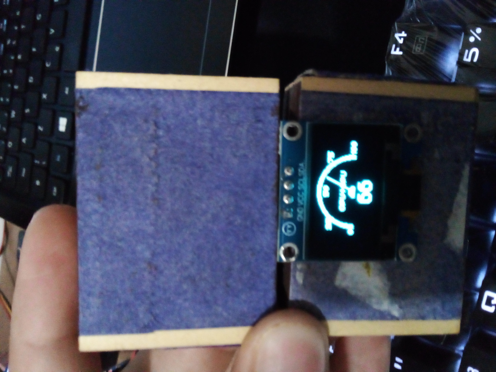

# pc-heat-check
a pc heat verifier using arduino uno and oled screen(ssd1306)

## Scripts:

to use scripts please verify the correct libraries:

  ## Using sensors

  ### Ubuntu-like
  ```bash 
    apt install lm-sensors
  ```
  ### Fedora

  ```bash 
    yum install lm_sensors
  ```
  
  ### Arch-like
  ```bash 
    sudo pacman -S lm_sensors
  ```

  ## Using ACPI

  ### Ubuntu-like
  ```bash 
    apt install acpi
  ```

  ### Fedora

  ```bash 
    yum install acpi
  ```

  ### Arch-like
  ```bash 
    pacman -S acpi
  ```

## WIndows

<p>to this application works needs this other application running: https://github.com/openhardwaremonitor/openhardwaremonitor/releases/tag/0.8.0</p>


<p>image with app on use:</p>
<div>
    
</div>
<br>
<p align="center">app in use showing cpu+gpu in integer format</p>
<div align="center">
    
</div>
<br>
<p align="center">app in use showing cpu+gpu in float point format</p>
<div align="center">
  
</div>
